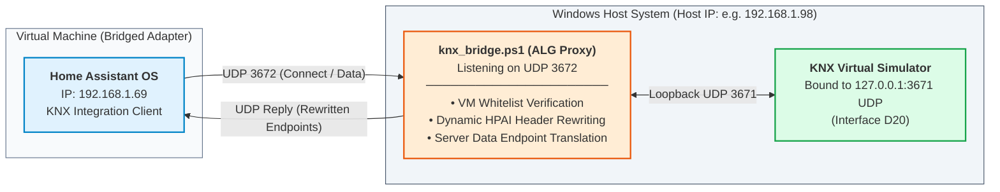

# KNX Virtual to Home Assistant UDP Gateway

[](https://opensource.org/licenses/MIT)
[](https://microsoft.com/powershell)
[](https://www.home-assistant.io/)

A lightweight, bidirectional **Application-Level Gateway (ALG)** written in PowerShell to bridge **KNX Virtual** with **Home Assistant OS** running inside a virtualized environment (VirtualBox, VMware) using a Bridged Network Adapter.

---

## The Problem

When setting up a simulated smart home / yacht automation testbed with **KNX Virtual** and a virtualized **Home Assistant OS**, communication fails due to several constraints:

1. **Loopback Exclusive Binding:** KNX Virtual binds strictly to `127.0.0.1:3671 UDP`. While a virtual machine with a bridged network adapter can reach the host's physical LAN IP, the Windows TCP/IP stack drops incoming UDP packets destined for loopback.
2. **Inadequacy of Native Port Proxies:** Tools like `netsh interface portproxy` operate strictly on TCP and cannot route UDP datagrams used by KNXnet/IP Tunneling v1.
3. **Application-Layer HPAI Headers:** KNXnet/IP control frames (`CONNECT_REQUEST`, `CONNECTIONSTATE_REQUEST`) embed the client's IP and ephemeral port inside the binary payload (**HPAI** - *Host Protocol Address Information*). When Home Assistant transmits its bridged IP (e.g., `192.168.1.69`), KNX Virtual fails to respond to external sockets from loopback.
4. **Server Data Endpoint Mismatch:** In the connection response (`0x0206 CONNECT_RESPONSE`), KNX Virtual tells the client to send all subsequent tunneling data (`0x0420 TUNNELING_REQUEST`) back to `127.0.0.1:3671`. If uncorrected, Home Assistant sends packets to its own local loopback, dropping the tunnel.

---

## Architecture & How It Works

This gateway operates on Windows host as an active **Application-Level Gateway**:


* **Upstream Translation (HA $\rightarrow$ KNX Virtual):** Rewrites the HPAI structures of `CONNECT_REQUEST` and `DESCRIPTION_REQUEST` from the VM's IP to `127.0.0.1` and points to an ephemeral host sender port.
* **Downstream Translation (KNX Virtual $\rightarrow$ HA):** Rewrites the *Server Data Endpoint* inside `CONNECT_RESPONSE` to the Windows physical LAN IP and port `3672`, ensuring Home Assistant directs future telegrams to this proxy.
* **Security Whitelist:** Silently drops any datagram not originating from the authorized Home Assistant VM IP before parsing memory.

---

## Prerequisites

* Windows 10 or Windows 11 (Host machine).
* [KNX Virtual](https://support.knx.org/hc/en-us/sections/360003367780-KNX-Virtual) (Installed and running).
* Home Assistant OS running inside VirtualBox / VMware configured with **Bridged Networking**.
* PowerShell 5.1 or later.

---

## Quick Start Guide

### 1. Configure Host Firewall & Network Profile
Run PowerShell as **Administrator** on the host machine to allow incoming UDP traffic on port `3672`:

```powershell
# Set network profile to Private (required for custom firewall routing)
Set-NetConnectionProfile -NetworkCategory Private

# Allow UDP port 3672 inbound
New-NetFirewallRule -DisplayName "KNX Virtual Bridge" -Direction Inbound -LocalPort 3672 -Protocol UDP -Action Allow

### 2. Configure Script

Open `knx_bridge.ps1` in a code editor and set your network variables at the top of the file:

```powershell
# IP address of your Home Assistant OS Virtual Machine (Bridged Adapter)
$HomeAssistantIP = "192.168.1.69"   # <-- Replace with your actual HA VM IP

# Physical IPv4 address of the Windows Host running KNX Virtual
# Leave empty ("") for automatic local route detection
$HostIPOverride = ""               # <-- (Optional) e.g., "192.168.1.98"
```

### 3. Launch KNX Virtual

1. Open **KNX Virtual**.
2. Make sure the IP interface (`D20`) is active.
3. Verify that the interface is listening on UDP port `3671` on `127.0.0.1`.

### 4. Run the Bridge

Open an elevated PowerShell terminal (**Run as Administrator**) on your Windows host and execute the script:

```powershell
powershell -ExecutionPolicy Bypass -File .\knx_bridge.ps1
```

Expected output in console:
```text
==========================================================
KNX UDP NAT APPLICATION GATEWAY ACTIVE (3672 <-> 3671)
Host IP: 192.168.1.98 | Authorized HA VM: 192.168.1.69
Local ephemeral port to simulator: 58672
==========================================================
```

### 5. Configure Home Assistant

1. In the Home Assistant web dashboard, navigate to **Settings** -> **Devices & Services** -> **Add Integration**.
2. Search for and select **KNX**.
3. Choose **Tunneling (UDP)** as the connection method.
4. Fill in the connection parameters:
   * **Host:** `<YOUR_WINDOWS_HOST_PHYSICAL_IP>` (e.g., `192.168.1.98`)
   * **Port:** `3672`
5. Click **Submit**. Home Assistant will establish the session and bind to logical individual address `1.0.255`.

### 6. Verify Communication

Once connected, trigger actions (e.g., turning on lights, moving blinds) or observe sensor telegrams. The PowerShell terminal logs all incoming and outgoing datagrams with decoded KNXnet/IP services in real time:

* `-> HA: CONNECT_REQUEST (HPAI translated to 127.0.0.1:58672)`
* `<- KNX: CONNECT_RESPONSE (Data Endpoint translated to 192.168.1.98:3672)`
* `-> HA: DATA TELEGRAM TUNNELING_REQUEST (21 bytes)`
* `<- KNX: TUNNELING_ACK (Command confirmed by actuator)`
* `<- KNX: STATE TELEGRAM (21 bytes)`

---

## License

This project is licensed under the **MIT License** - see the [LICENSE](LICENSE) file for details.
